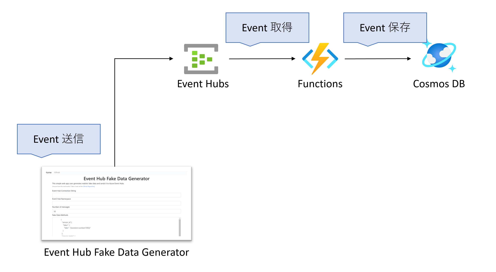
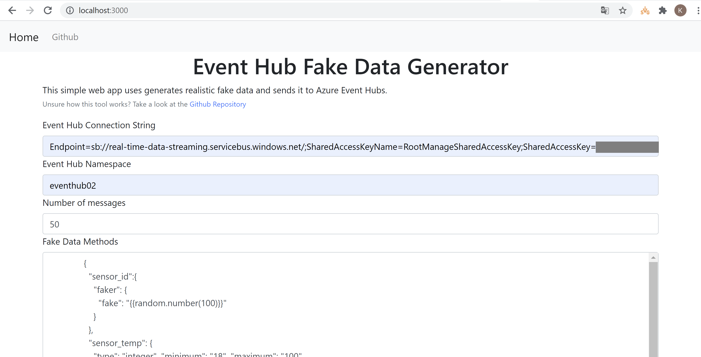

# Real Time Data Streaming

This sample content demonstrates how to process real-time data in Azure.

Table of Contents
=================

Architecture
=================



## Prerequisites

- Microsoft Azure Subscription
- java 8 or higher
- Cosmos DB Emulator ([How to install](https://docs.microsoft.com/en-us/azure/cosmos-db/local-emulator?tabs=ssl-netstd21))
- Storage Emulator ([How to install](https://docs.microsoft.com/en-us/azure/storage/common/storage-use-azurite?toc=%2Fazure%2Fstorage%2Fblobs%2Ftoc.json&tabs=visual-studio))

### Optional

- `az` command
- .NET 5 or higher
- Visual Studio Code ([How to install](https://code.visualstudio.com/download))

## Set up Event Hub Data Generator (EHDG)

Event Hub Data Generator (EHDG) is a tool which generates realistic fake data based on a provided schema and sends it to Azure Event Hubs.

In this content, you will set up EHDG locally.

Follow the instruction [here](https://github.com/JalalUddin7/EventHubDataGenerator/blob/master/documentation/Deploying%20EHDG%20(locally).md) to set up EHDG.

## Send sample event to Event Hub with EHDG

First, you have to run Azure Functions to check if data is sent to Event Hub.

You just push `[F5]` button to run Azure Functions locally.

Below is a sample output when running Azure Functions locally.

```log
Azure Functions Core Tools
Core Tools Version:       3.0.3477 Commit hash: 5fbb9a76fc00e4168f2cc90d6ff0afe5373afc6d  (64-bit)    
Function Runtime Version: 3.0.15584.0

[2021-08-28T11:18:45.290Z] Worker process started and initialized.

Functions:

        EventHubTrigger: eventHubTrigger

For detailed output, run func with --verbose flag.
```

In order to send data to Event Hub, you just have to input `Event Hub Connection String` and `Event Hub Namespace` like below.



After submitting events, logs will be output in terminal.

```log
[2021-08-28T11:21:04.943Z] Java Event Hub trigger function executed.
[2021-08-28T11:21:04.954Z] Length:1
[2021-08-28T11:21:04.960Z] {"sensor_id":"84","sensor_temp":81,"sensor_status":"WARN"}
[2021-08-28T11:21:04.964Z] Function "EventHubTrigger" (Id: 1b0d13ee-b7ed-46c2-812e-a9ec350ec7a0) invoked by Java Worker
[2021-08-28T11:21:04.976Z] Executed 'Functions.EventHubTrigger' (Succeeded, Id=1b0d13ee-b7ed-46c2-812e-a9ec350ec7a0, Duration=40ms)
```

### 【Additional】 In case you cannot use EHDG

If you cannot use EHDG for some reasons, you can try this content with sample C# code, which will send sample json data to your Event Hub.

You just have to clone this repositry. The sample sender content is in `Sender` directory.

```powershell
└─Sender
    ├─bin
    │  └─Debug
    │      └─netcoreapp3.1
    └─obj
        └─Debug
            └─netcoreapp3.1
```

## 【WIP】Store data into Azure Cosmos DB


## 【WIP】Partition

In this case, I sent 50 events to each Event Hub.

### Event Hub w/ 1 Partition

1 -> 10 -> 10 -> 10 -> 10 -> 9

```log
[2021-08-28T11:41:25.010Z] Executing 'Functions.EventHubTrigger' (Reason='(null)', Id=7b9ca2bb-c6ec-4aa7-be93-1ffdf61ffd16)
[2021-08-28T11:41:25.089Z] Length:1
[2021-08-28T11:41:25.091Z] {"sensor_id":"45","sensor_temp":76,"sensor_status":"WARN"}
[2021-08-28T11:41:25.093Z] Function "EventHubTrigger" (Id: 7b9ca2bb-c6ec-4aa7-be93-1ffdf61ffd16) invoked by Java Worker
[2021-08-28T11:41:25.119Z] Executed 'Functions.EventHubTrigger' (Succeeded, Id=7b9ca2bb-c6ec-4aa7-be93-1ffdf61ffd16, Duration=117ms)
[2021-08-28T11:41:25.307Z] Executing 'Functions.EventHubTrigger' (Reason='(null)', Id=719e8f22-ed7a-4edf-b0fb-638f355ae68a)
[2021-08-28T11:41:25.312Z] Length:10
[2021-08-28T11:41:25.316Z] {"sensor_id":"47","sensor_temp":66,"sensor_status":"OK"}
[2021-08-28T11:41:25.318Z] {"sensor_id":"20","sensor_temp":50,"sensor_status":"FAIL"}
[2021-08-28T11:41:25.319Z] {"sensor_id":"59","sensor_temp":85,"sensor_status":"OK"}
[2021-08-28T11:41:25.320Z] {"sensor_id":"10","sensor_temp":93,"sensor_status":"OK"}
[2021-08-28T11:41:25.321Z] {"sensor_id":"42","sensor_temp":48,"sensor_status":"WARN"}
[2021-08-28T11:41:25.322Z] {"sensor_id":"30","sensor_temp":63,"sensor_status":"OK"}
[2021-08-28T11:41:25.323Z] {"sensor_id":"14","sensor_temp":22,"sensor_status":"WARN"}
[2021-08-28T11:41:25.324Z] {"sensor_id":"40","sensor_temp":61,"sensor_status":"OK"}
[2021-08-28T11:41:25.324Z] {"sensor_id":"55","sensor_temp":46,"sensor_status":"WARN"}
[2021-08-28T11:41:25.325Z] {"sensor_id":"37","sensor_temp":54,"sensor_status":"OK"}
[2021-08-28T11:41:25.326Z] Function "EventHubTrigger" (Id: 719e8f22-ed7a-4edf-b0fb-638f355ae68a) invoked by Java Worker
[2021-08-28T11:41:25.328Z] Executed 'Functions.EventHubTrigger' (Succeeded, Id=719e8f22-ed7a-4edf-b0fb-638f355ae68a, Duration=21ms)
[2021-08-28T11:41:25.909Z] Executing 'Functions.EventHubTrigger' (Reason='(null)', Id=8a1a31ef-a3b7-4516-952f-aead5a46f747)
[2021-08-28T11:41:25.917Z] Length:10
[2021-08-28T11:41:25.926Z] {"sensor_id":"29","sensor_temp":93,"sensor_status":"OK"}
[2021-08-28T11:41:25.929Z] {"sensor_id":"65","sensor_temp":53,"sensor_status":"FAIL"}
[2021-08-28T11:41:25.934Z] {"sensor_id":"56","sensor_temp":96,"sensor_status":"WARN"}
[2021-08-28T11:41:25.943Z] {"sensor_id":"38","sensor_temp":97,"sensor_status":"FAIL"}
[2021-08-28T11:41:25.946Z] {"sensor_id":"20","sensor_temp":35,"sensor_status":"FAIL"}
[2021-08-28T11:41:25.949Z] {"sensor_id":"4","sensor_temp":38,"sensor_status":"FAIL"}
[2021-08-28T11:41:25.958Z] {"sensor_id":"57","sensor_temp":49,"sensor_status":"OK"}
[2021-08-28T11:41:25.960Z] {"sensor_id":"26","sensor_temp":21,"sensor_status":"WARN"}
[2021-08-28T11:41:25.962Z] {"sensor_id":"13","sensor_temp":31,"sensor_status":"OK"}
[2021-08-28T11:41:25.965Z] {"sensor_id":"70","sensor_temp":35,"sensor_status":"OK"}
[2021-08-28T11:41:25.977Z] Function "EventHubTrigger" (Id: 8a1a31ef-a3b7-4516-952f-aead5a46f747) invoked by Java Worker
[2021-08-28T11:41:25.984Z] Executed 'Functions.EventHubTrigger' (Succeeded, Id=8a1a31ef-a3b7-4516-952f-aead5a46f747, Duration=76ms)
[2021-08-28T11:41:26.363Z] Executing 'Functions.EventHubTrigger' (Reason='(null)', Id=bdd31c10-468a-4d13-983d-ebb801a0a7d5)
[2021-08-28T11:41:26.373Z] Length:10
[2021-08-28T11:41:26.376Z] {"sensor_id":"52","sensor_temp":62,"sensor_status":"WARN"}
[2021-08-28T11:41:26.378Z] {"sensor_id":"96","sensor_temp":41,"sensor_status":"OK"}
[2021-08-28T11:41:26.382Z] {"sensor_id":"19","sensor_temp":50,"sensor_status":"FAIL"}
[2021-08-28T11:41:26.384Z] {"sensor_id":"35","sensor_temp":42,"sensor_status":"OK"}
[2021-08-28T11:41:26.386Z] {"sensor_id":"61","sensor_temp":93,"sensor_status":"FAIL"}
[2021-08-28T11:41:26.389Z] {"sensor_id":"45","sensor_temp":21,"sensor_status":"WARN"}
[2021-08-28T11:41:26.391Z] {"sensor_id":"42","sensor_temp":36,"sensor_status":"OK"}
[2021-08-28T11:41:26.393Z] {"sensor_id":"45","sensor_temp":58,"sensor_status":"WARN"}
[2021-08-28T11:41:26.395Z] {"sensor_id":"80","sensor_temp":100,"sensor_status":"FAIL"}
[2021-08-28T11:41:26.396Z] {"sensor_id":"81","sensor_temp":82,"sensor_status":"FAIL"}
[2021-08-28T11:41:26.398Z] Function "EventHubTrigger" (Id: bdd31c10-468a-4d13-983d-ebb801a0a7d5) invoked by Java Worker
[2021-08-28T11:41:26.400Z] Executed 'Functions.EventHubTrigger' (Succeeded, Id=bdd31c10-468a-4d13-983d-ebb801a0a7d5, Duration=38ms)
[2021-08-28T11:41:26.662Z] Executing 'Functions.EventHubTrigger' (Reason='(null)', Id=63516233-49ca-49fe-8631-31fc7a398db4)
[2021-08-28T11:41:26.670Z] Length:10
[2021-08-28T11:41:26.672Z] {"sensor_id":"1","sensor_temp":61,"sensor_status":"FAIL"}
[2021-08-28T11:41:26.674Z] {"sensor_id":"80","sensor_temp":63,"sensor_status":"WARN"}
[2021-08-28T11:41:26.676Z] {"sensor_id":"33","sensor_temp":75,"sensor_status":"FAIL"}
[2021-08-28T11:41:26.678Z] {"sensor_id":"77","sensor_temp":77,"sensor_status":"OK"}
[2021-08-28T11:41:26.679Z] {"sensor_id":"83","sensor_temp":31,"sensor_status":"OK"}
[2021-08-28T11:41:26.680Z] {"sensor_id":"35","sensor_temp":95,"sensor_status":"FAIL"}
[2021-08-28T11:41:26.681Z] {"sensor_id":"80","sensor_temp":39,"sensor_status":"OK"}
[2021-08-28T11:41:26.683Z] {"sensor_id":"52","sensor_temp":97,"sensor_status":"WARN"}
[2021-08-28T11:41:26.685Z] {"sensor_id":"88","sensor_temp":37,"sensor_status":"FAIL"}
[2021-08-28T11:41:26.686Z] {"sensor_id":"84","sensor_temp":88,"sensor_status":"OK"}
[2021-08-28T11:41:26.687Z] Function "EventHubTrigger" (Id: 63516233-49ca-49fe-8631-31fc7a398db4) invoked by Java Worker
[2021-08-28T11:41:26.689Z] Executed 'Functions.EventHubTrigger' (Succeeded, Id=63516233-49ca-49fe-8631-31fc7a398db4, Duration=27ms)
[2021-08-28T11:41:26.959Z] Executing 'Functions.EventHubTrigger' (Reason='(null)', Id=166bf77b-1b32-4246-a729-3d4fa948279c)
[2021-08-28T11:41:26.963Z] Length:9
[2021-08-28T11:41:26.965Z] {"sensor_id":"79","sensor_temp":91,"sensor_status":"FAIL"}
[2021-08-28T11:41:26.966Z] {"sensor_id":"45","sensor_temp":25,"sensor_status":"OK"}
[2021-08-28T11:41:26.967Z] {"sensor_id":"65","sensor_temp":59,"sensor_status":"WARN"}
[2021-08-28T11:41:26.968Z] {"sensor_id":"32","sensor_temp":67,"sensor_status":"OK"}
[2021-08-28T11:41:26.969Z] {"sensor_id":"60","sensor_temp":27,"sensor_status":"WARN"}
[2021-08-28T11:41:26.971Z] {"sensor_id":"19","sensor_temp":23,"sensor_status":"OK"}
[2021-08-28T11:41:26.973Z] {"sensor_id":"88","sensor_temp":34,"sensor_status":"WARN"}
[2021-08-28T11:41:26.975Z] {"sensor_id":"97","sensor_temp":79,"sensor_status":"FAIL"}
[2021-08-28T11:41:26.976Z] {"sensor_id":"62","sensor_temp":51,"sensor_status":"FAIL"}
[2021-08-28T11:41:26.977Z] Function "EventHubTrigger" (Id: 166bf77b-1b32-4246-a729-3d4fa948279c) invoked by Java Worker
[2021-08-28T11:41:26.979Z] Executed 'Functions.EventHubTrigger' (Succeeded, Id=166bf77b-1b32-4246-a729-3d4fa948279c, Duration=19ms)
```

### Event Hub w/ 32 Partitions

1 or 2

```log
[2021-08-28T11:46:27.708Z] Executing 'Functions.EventHubTrigger' (Reason='(null)', Id=4c88e233-a895-4562-bde7-137c14abeaf2)
[2021-08-28T11:46:27.708Z] Executing 'Functions.EventHubTrigger' (Reason='(null)', Id=9c54499d-de92-473b-be3d-e6964ad6890e)
[2021-08-28T11:46:27.708Z] Executing 'Functions.EventHubTrigger' (Reason='(null)', Id=fde4954c-8d82-4f98-ba23-045898863b5c)
[2021-08-28T11:46:27.749Z] Executing 'Functions.EventHubTrigger' (Reason='(null)', Id=f4bec33f-80be-43e4-b1e2-8707113e4c74)
[2021-08-28T11:46:27.809Z] Executing 'Functions.EventHubTrigger' (Reason='(null)', Id=0c1c45e2-4e0b-4660-b1c1-c5330be39979)
[2021-08-28T11:46:27.839Z] Length:1
[2021-08-28T11:46:27.846Z] Length:1
[2021-08-28T11:46:27.851Z] Length:2
[2021-08-28T11:46:27.855Z] Length:2
[2021-08-28T11:46:27.863Z] Executing 'Functions.EventHubTrigger' (Reason='(null)', Id=bfe717e7-27ac-4eb1-afd5-f414d2741b18)[2021-08-28T11:46:27.864Z] Length:2

[2021-08-28T11:46:27.867Z] {"sensor_id":"70","sensor_temp":62,"sensor_status":"FAIL"}
[2021-08-28T11:46:27.869Z] {"sensor_id":"3","sensor_temp":50,"sensor_status":"FAIL"}
[2021-08-28T11:46:27.871Z] {"sensor_id":"2","sensor_temp":54,"sensor_status":"FAIL"}
[2021-08-28T11:46:27.875Z] {"sensor_id":"61","sensor_temp":61,"sensor_status":"FAIL"}
[2021-08-28T11:46:27.878Z] {"sensor_id":"17","sensor_temp":19,"sensor_status":"WARN"}
[2021-08-28T11:46:27.879Z] {"sensor_id":"29","sensor_temp":80,"sensor_status":"WARN"}
[2021-08-28T11:46:27.881Z] {"sensor_id":"64","sensor_temp":63,"sensor_status":"WARN"}
[2021-08-28T11:46:27.882Z] {"sensor_id":"43","sensor_temp":91,"sensor_status":"FAIL"}
[2021-08-28T11:46:27.885Z] Function "EventHubTrigger" (Id: 9c54499d-de92-473b-be3d-e6964ad6890e) invoked by Java Worker
[2021-08-28T11:46:27.886Z] Function "EventHubTrigger" (Id: 4c88e233-a895-4562-bde7-137c14abeaf2) invoked by Java Worker
[2021-08-28T11:46:27.887Z] Function "EventHubTrigger" (Id: fde4954c-8d82-4f98-ba23-045898863b5c) invoked by Java Worker
[2021-08-28T11:46:27.890Z] Function "EventHubTrigger" (Id: 0c1c45e2-4e0b-4660-b1c1-c5330be39979) invoked by Java Worker
[2021-08-28T11:46:27.906Z] Executing 'Functions.EventHubTrigger' (Reason='(null)', Id=8c63d657-b550-4569-92f5-b6277a0cfbeb)
[2021-08-28T11:46:27.929Z] Executed 'Functions.EventHubTrigger' (Succeeded, Id=fde4954c-8d82-4f98-ba23-045898863b5c, Duration=232ms)
[2021-08-28T11:46:27.944Z] Executed 'Functions.EventHubTrigger' (Succeeded, Id=4c88e233-a895-4562-bde7-137c14abeaf2, Duration=261ms)
[2021-08-28T11:46:27.947Z] Function "EventHubTrigger" (Id: f4bec33f-80be-43e4-b1e2-8707113e4c74) invoked by Java Worker
[2021-08-28T11:46:27.950Z] Executed 'Functions.EventHubTrigger' (Succeeded, Id=f4bec33f-80be-43e4-b1e2-8707113e4c74, Duration=201ms)
[2021-08-28T11:46:27.953Z] Executed 'Functions.EventHubTrigger' (Succeeded, Id=9c54499d-de92-473b-be3d-e6964ad6890e, Duration=270ms)
[2021-08-28T11:46:27.958Z] Executed 'Functions.EventHubTrigger' (Succeeded, Id=0c1c45e2-4e0b-4660-b1c1-c5330be39979, Duration=148ms)
[2021-08-28T11:46:27.963Z] Length:2
[2021-08-28T11:46:27.966Z] {"sensor_id":"77","sensor_temp":37,"sensor_status":"FAIL"}
[2021-08-28T11:46:27.974Z] {"sensor_id":"66","sensor_temp":87,"sensor_status":"FAIL"}
[2021-08-28T11:46:27.983Z] Executing 'Functions.EventHubTrigger' (Reason='(null)', Id=70cba07d-104e-41dc-bed5-4fa3252f4a58)[2021-08-28T11:46:27.984Z] Function "EventHubTrigger" (Id: bfe717e7-27ac-4eb1-afd5-f414d2741b18) invoked by Java Worker

[2021-08-28T11:46:27.986Z] Executed 'Functions.EventHubTrigger' (Succeeded, Id=bfe717e7-27ac-4eb1-afd5-f414d2741b18, Duration=123ms)
[2021-08-28T11:46:27.996Z] Length:1
[2021-08-28T11:46:28.012Z] {"sensor_id":"59","sensor_temp":52,"sensor_status":"OK"}
[2021-08-28T11:46:28.013Z] Function "EventHubTrigger" (Id: 8c63d657-b550-4569-92f5-b6277a0cfbeb) invoked by Java Worker
[2021-08-28T11:46:28.016Z] Executed 'Functions.EventHubTrigger' (Succeeded, Id=8c63d657-b550-4569-92f5-b6277a0cfbeb, Duration=110ms)
[2021-08-28T11:46:28.032Z] Length:2
[2021-08-28T11:46:28.033Z] {"sensor_id":"7","sensor_temp":85,"sensor_status":"FAIL"}
[2021-08-28T11:46:28.044Z] {"sensor_id":"43","sensor_temp":27,"sensor_status":"OK"}
[2021-08-28T11:46:28.049Z] Function "EventHubTrigger" (Id: 70cba07d-104e-41dc-bed5-4fa3252f4a58) invoked by Java Worker
[2021-08-28T11:46:28.064Z] Executed 'Functions.EventHubTrigger' (Succeeded, Id=70cba07d-104e-41dc-bed5-4fa3252f4a58, Duration=81ms)
[2021-08-28T11:46:28.064Z] Executing 'Functions.EventHubTrigger' (Reason='(null)', Id=278c5d05-254a-4ad1-8176-4b97f452cf44)
[2021-08-28T11:46:28.079Z] Length:1
[2021-08-28T11:46:28.081Z] {"sensor_id":"28","sensor_temp":63,"sensor_status":"FAIL"}
[2021-08-28T11:46:28.086Z] Function "EventHubTrigger" (Id: 278c5d05-254a-4ad1-8176-4b97f452cf44) invoked by Java Worker
[2021-08-28T11:46:28.096Z] Executed 'Functions.EventHubTrigger' (Succeeded, Id=278c5d05-254a-4ad1-8176-4b97f452cf44, Duration=32ms)
[2021-08-28T11:46:28.202Z] Executing 'Functions.EventHubTrigger' (Reason='(null)', Id=6d089f9e-1a28-4fbd-a279-fd911beb084c)
[2021-08-28T11:46:28.208Z] Executing 'Functions.EventHubTrigger' (Reason='(null)', Id=2702d27e-f796-442e-b676-d0eb52bb450c)
[2021-08-28T11:46:28.213Z] Length:1
[2021-08-28T11:46:28.224Z] {"sensor_id":"57","sensor_temp":24,"sensor_status":"WARN"}
[2021-08-28T11:46:28.227Z] Function "EventHubTrigger" (Id: 6d089f9e-1a28-4fbd-a279-fd911beb084c) invoked by Java Worker
[2021-08-28T11:46:28.235Z] Executed 'Functions.EventHubTrigger' (Succeeded, Id=6d089f9e-1a28-4fbd-a279-fd911beb084c, Duration=28ms)
[2021-08-28T11:46:28.249Z] Length:1
[2021-08-28T11:46:28.251Z] Executing 'Functions.EventHubTrigger' (Reason='(null)', Id=74c0c239-71c1-4a5e-a870-c01de08af559)
[2021-08-28T11:46:28.260Z] {"sensor_id":"43","sensor_temp":21,"sensor_status":"WARN"}
[2021-08-28T11:46:28.262Z] Function "EventHubTrigger" (Id: 2702d27e-f796-442e-b676-d0eb52bb450c) invoked by Java Worker
[2021-08-28T11:46:28.282Z] Executed 'Functions.EventHubTrigger' (Succeeded, Id=2702d27e-f796-442e-b676-d0eb52bb450c, Duration=74ms)
[2021-08-28T11:46:28.299Z] Length:1
[2021-08-28T11:46:28.307Z] {"sensor_id":"94","sensor_temp":96,"sensor_status":"OK"}
[2021-08-28T11:46:28.316Z] Function "EventHubTrigger" (Id: 74c0c239-71c1-4a5e-a870-c01de08af559) invoked by Java Worker
[2021-08-28T11:46:28.332Z] Executed 'Functions.EventHubTrigger' (Succeeded, Id=74c0c239-71c1-4a5e-a870-c01de08af559, Duration=81ms)
[2021-08-28T11:46:28.391Z] Executing 'Functions.EventHubTrigger' (Reason='(null)', Id=2e3bbc32-f5ca-44a6-a36c-a4702b3d5faa)
[2021-08-28T11:46:28.401Z] Executing 'Functions.EventHubTrigger' (Reason='(null)', Id=065ec053-7175-4e7a-9c4b-55ab6d7d82c9)
[2021-08-28T11:46:28.409Z] Length:1
[2021-08-28T11:46:28.417Z] {"sensor_id":"95","sensor_temp":96,"sensor_status":"OK"}
[2021-08-28T11:46:28.426Z] Function "EventHubTrigger" (Id: 2e3bbc32-f5ca-44a6-a36c-a4702b3d5faa) invoked by Java Worker
[2021-08-28T11:46:28.438Z] Executed 'Functions.EventHubTrigger' (Succeeded, Id=2e3bbc32-f5ca-44a6-a36c-a4702b3d5faa, Duration=47ms)
[2021-08-28T11:46:28.445Z] Length:1
[2021-08-28T11:46:28.449Z] {"sensor_id":"32","sensor_temp":39,"sensor_status":"WARN"}
[2021-08-28T11:46:28.452Z] Function "EventHubTrigger" (Id: 065ec053-7175-4e7a-9c4b-55ab6d7d82c9) invoked by Java Worker
[2021-08-28T11:46:28.454Z] Executed 'Functions.EventHubTrigger' (Succeeded, Id=065ec053-7175-4e7a-9c4b-55ab6d7d82c9, Duration=54ms)
[2021-08-28T11:46:28.536Z] Executing 'Functions.EventHubTrigger' (Reason='(null)', Id=7b7d9b08-53b8-468e-a275-45de772c9f73)
[2021-08-28T11:46:28.566Z] Length:1
[2021-08-28T11:46:28.570Z] {"sensor_id":"70","sensor_temp":71,"sensor_status":"WARN"}
[2021-08-28T11:46:28.577Z] Function "EventHubTrigger" (Id: 7b7d9b08-53b8-468e-a275-45de772c9f73) invoked by Java Worker
[2021-08-28T11:46:28.582Z] Executed 'Functions.EventHubTrigger' (Succeeded, Id=7b7d9b08-53b8-468e-a275-45de772c9f73, Duration=50ms)
[2021-08-28T11:46:28.654Z] Executing 'Functions.EventHubTrigger' (Reason='(null)', Id=bd322242-0e31-4ff5-af7e-6ba9faf40109)
[2021-08-28T11:46:28.677Z] Length:1
[2021-08-28T11:46:28.680Z] {"sensor_id":"93","sensor_temp":80,"sensor_status":"WARN"}
[2021-08-28T11:46:28.684Z] Function "EventHubTrigger" (Id: bd322242-0e31-4ff5-af7e-6ba9faf40109) invoked by Java Worker
[2021-08-28T11:46:28.690Z] Executed 'Functions.EventHubTrigger' (Succeeded, Id=bd322242-0e31-4ff5-af7e-6ba9faf40109, Duration=36ms)
[2021-08-28T11:46:28.766Z] Executing 'Functions.EventHubTrigger' (Reason='(null)', Id=e9f9e7f3-293a-4d51-9819-a51c949c3939)
[2021-08-28T11:46:28.779Z] Length:1
[2021-08-28T11:46:28.782Z] {"sensor_id":"37","sensor_temp":86,"sensor_status":"FAIL"}
[2021-08-28T11:46:28.783Z] Function "EventHubTrigger" (Id: e9f9e7f3-293a-4d51-9819-a51c949c3939) invoked by Java Worker
[2021-08-28T11:46:28.786Z] Executed 'Functions.EventHubTrigger' (Succeeded, Id=e9f9e7f3-293a-4d51-9819-a51c949c3939, Duration=20ms)
[2021-08-28T11:46:28.851Z] Executing 'Functions.EventHubTrigger' (Reason='(null)', Id=7d56688c-c51a-425d-83a9-8b11619dabd8)
[2021-08-28T11:46:28.860Z] Length:1
[2021-08-28T11:46:28.864Z] {"sensor_id":"13","sensor_temp":63,"sensor_status":"FAIL"}
[2021-08-28T11:46:28.866Z] Function "EventHubTrigger" (Id: 7d56688c-c51a-425d-83a9-8b11619dabd8) invoked by Java Worker
[2021-08-28T11:46:28.868Z] Executed 'Functions.EventHubTrigger' (Succeeded, Id=7d56688c-c51a-425d-83a9-8b11619dabd8, Duration=17ms)
[2021-08-28T11:46:28.960Z] Executing 'Functions.EventHubTrigger' (Reason='(null)', Id=fe2a67a7-48d0-42b0-9bc1-124691ab8eb9)
[2021-08-28T11:46:28.967Z] Length:1
[2021-08-28T11:46:28.969Z] {"sensor_id":"69","sensor_temp":25,"sensor_status":"FAIL"}
[2021-08-28T11:46:28.971Z] Function "EventHubTrigger" (Id: fe2a67a7-48d0-42b0-9bc1-124691ab8eb9) invoked by Java Worker
[2021-08-28T11:46:28.973Z] Executed 'Functions.EventHubTrigger' (Succeeded, Id=fe2a67a7-48d0-42b0-9bc1-124691ab8eb9, Duration=13ms)
[2021-08-28T11:46:29.027Z] Executing 'Functions.EventHubTrigger' (Reason='(null)', Id=99bc7bdc-030b-4f5f-9376-7f65db55aabf)
[2021-08-28T11:46:29.034Z] Length:1
[2021-08-28T11:46:29.036Z] {"sensor_id":"86","sensor_temp":29,"sensor_status":"WARN"}
[2021-08-28T11:46:29.039Z] Function "EventHubTrigger" (Id: 99bc7bdc-030b-4f5f-9376-7f65db55aabf) invoked by Java Worker
[2021-08-28T11:46:29.045Z] Executed 'Functions.EventHubTrigger' (Succeeded, Id=99bc7bdc-030b-4f5f-9376-7f65db55aabf, Duration=19ms)
[2021-08-28T11:46:29.120Z] Executing 'Functions.EventHubTrigger' (Reason='(null)', Id=108f5263-8bc7-44db-9441-11e1d7cd908f)
[2021-08-28T11:46:29.139Z] Length:1
[2021-08-28T11:46:29.144Z] {"sensor_id":"8","sensor_temp":40,"sensor_status":"WARN"}
[2021-08-28T11:46:29.150Z] Function "EventHubTrigger" (Id: 108f5263-8bc7-44db-9441-11e1d7cd908f) invoked by Java Worker
[2021-08-28T11:46:29.154Z] Executed 'Functions.EventHubTrigger' (Succeeded, Id=108f5263-8bc7-44db-9441-11e1d7cd908f, Duration=34ms)
[2021-08-28T11:46:29.216Z] Executing 'Functions.EventHubTrigger' (Reason='(null)', Id=ef7734ac-8807-495c-b7e6-be7754630a99)
[2021-08-28T11:46:29.224Z] Length:1
[2021-08-28T11:46:29.228Z] {"sensor_id":"7","sensor_temp":29,"sensor_status":"OK"}
[2021-08-28T11:46:29.230Z] Function "EventHubTrigger" (Id: ef7734ac-8807-495c-b7e6-be7754630a99) invoked by Java Worker
[2021-08-28T11:46:29.232Z] Executed 'Functions.EventHubTrigger' (Succeeded, Id=ef7734ac-8807-495c-b7e6-be7754630a99, Duration=16ms)
[2021-08-28T11:46:29.294Z] Executing 'Functions.EventHubTrigger' (Reason='(null)', Id=e326b3bf-a161-4113-bdb4-affbea96655d)
[2021-08-28T11:46:29.303Z] Length:1
[2021-08-28T11:46:29.305Z] {"sensor_id":"42","sensor_temp":21,"sensor_status":"FAIL"}
[2021-08-28T11:46:29.312Z] Function "EventHubTrigger" (Id: e326b3bf-a161-4113-bdb4-affbea96655d) invoked by Java Worker
[2021-08-28T11:46:29.319Z] Executed 'Functions.EventHubTrigger' (Succeeded, Id=e326b3bf-a161-4113-bdb4-affbea96655d, Duration=25ms)
[2021-08-28T11:46:29.399Z] Executing 'Functions.EventHubTrigger' (Reason='(null)', Id=63e6d551-aef6-49df-9e5c-bb3150d7fdb8)
[2021-08-28T11:46:29.406Z] Length:1
[2021-08-28T11:46:29.411Z] {"sensor_id":"26","sensor_temp":21,"sensor_status":"FAIL"}
[2021-08-28T11:46:29.413Z] Function "EventHubTrigger" (Id: 63e6d551-aef6-49df-9e5c-bb3150d7fdb8) invoked by Java Worker
[2021-08-28T11:46:29.417Z] Executed 'Functions.EventHubTrigger' (Succeeded, Id=63e6d551-aef6-49df-9e5c-bb3150d7fdb8, Duration=18ms)
[2021-08-28T11:46:29.499Z] Executing 'Functions.EventHubTrigger' (Reason='(null)', Id=f07f85cf-3cfc-437e-b7c6-29b638fa8724)
[2021-08-28T11:46:29.504Z] Length:1
[2021-08-28T11:46:29.505Z] {"sensor_id":"46","sensor_temp":39,"sensor_status":"WARN"}
[2021-08-28T11:46:29.507Z] Function "EventHubTrigger" (Id: f07f85cf-3cfc-437e-b7c6-29b638fa8724) invoked by Java Worker
[2021-08-28T11:46:29.512Z] Executed 'Functions.EventHubTrigger' (Succeeded, Id=f07f85cf-3cfc-437e-b7c6-29b638fa8724, Duration=13ms)
[2021-08-28T11:46:29.560Z] Executing 'Functions.EventHubTrigger' (Reason='(null)', Id=9bda2846-7925-4657-a33f-971c4abe484f)
[2021-08-28T11:46:29.566Z] Length:2
[2021-08-28T11:46:29.568Z] {"sensor_id":"31","sensor_temp":91,"sensor_status":"FAIL"}
[2021-08-28T11:46:29.570Z] {"sensor_id":"22","sensor_temp":65,"sensor_status":"OK"}
[2021-08-28T11:46:29.572Z] Function "EventHubTrigger" (Id: 9bda2846-7925-4657-a33f-971c4abe484f) invoked by Java Worker
[2021-08-28T11:46:29.581Z] Executed 'Functions.EventHubTrigger' (Succeeded, Id=9bda2846-7925-4657-a33f-971c4abe484f, Duration=21ms)
[2021-08-28T11:46:29.645Z] Executing 'Functions.EventHubTrigger' (Reason='(null)', Id=af5e74bc-a171-4d61-8499-3b0ed17f7863)
[2021-08-28T11:46:29.719Z] Length:2
[2021-08-28T11:46:29.743Z] {"sensor_id":"29","sensor_temp":92,"sensor_status":"WARN"}
[2021-08-28T11:46:29.746Z] {"sensor_id":"52","sensor_temp":28,"sensor_status":"OK"}
[2021-08-28T11:46:29.748Z] Function "EventHubTrigger" (Id: af5e74bc-a171-4d61-8499-3b0ed17f7863) invoked by Java Worker
[2021-08-28T11:46:29.752Z] Executed 'Functions.EventHubTrigger' (Succeeded, Id=af5e74bc-a171-4d61-8499-3b0ed17f7863, Duration=106ms)
[2021-08-28T11:46:29.849Z] Executing 'Functions.EventHubTrigger' (Reason='(null)', Id=1d28a4c0-869e-4f15-b3d4-a746c853b496)
[2021-08-28T11:46:29.863Z] Length:2
[2021-08-28T11:46:29.866Z] {"sensor_id":"25","sensor_temp":25,"sensor_status":"FAIL"}
[2021-08-28T11:46:29.868Z] {"sensor_id":"75","sensor_temp":56,"sensor_status":"OK"}
[2021-08-28T11:46:29.869Z] Function "EventHubTrigger" (Id: 1d28a4c0-869e-4f15-b3d4-a746c853b496) invoked by Java Worker
[2021-08-28T11:46:29.872Z] Executed 'Functions.EventHubTrigger' (Succeeded, Id=1d28a4c0-869e-4f15-b3d4-a746c853b496, Duration=23ms)
[2021-08-28T11:46:29.943Z] Executing 'Functions.EventHubTrigger' (Reason='(null)', Id=ae18d50d-4fc4-428c-a98e-951d4c390a91)
[2021-08-28T11:46:29.951Z] Length:2
[2021-08-28T11:46:29.952Z] {"sensor_id":"2","sensor_temp":53,"sensor_status":"OK"}
[2021-08-28T11:46:29.954Z] {"sensor_id":"36","sensor_temp":79,"sensor_status":"OK"}
[2021-08-28T11:46:29.956Z] Function "EventHubTrigger" (Id: ae18d50d-4fc4-428c-a98e-951d4c390a91) invoked by Java Worker
[2021-08-28T11:46:29.961Z] Executed 'Functions.EventHubTrigger' (Succeeded, Id=ae18d50d-4fc4-428c-a98e-951d4c390a91, Duration=20ms)
[2021-08-28T11:46:30.021Z] Executing 'Functions.EventHubTrigger' (Reason='(null)', Id=5f082d98-c7b3-49a7-97b4-f1bda87cf200)
[2021-08-28T11:46:30.030Z] Length:2
[2021-08-28T11:46:30.033Z] {"sensor_id":"22","sensor_temp":33,"sensor_status":"FAIL"}
[2021-08-28T11:46:30.035Z] {"sensor_id":"1","sensor_temp":19,"sensor_status":"WARN"}
[2021-08-28T11:46:30.037Z] Function "EventHubTrigger" (Id: 5f082d98-c7b3-49a7-97b4-f1bda87cf200) invoked by Java Worker
[2021-08-28T11:46:30.041Z] Executed 'Functions.EventHubTrigger' (Succeeded, Id=5f082d98-c7b3-49a7-97b4-f1bda87cf200, Duration=19ms)
[2021-08-28T11:46:30.128Z] Executing 'Functions.EventHubTrigger' (Reason='(null)', Id=ffe9c1e7-617f-4c4f-a2fb-e3bbacbd2acc)
[2021-08-28T11:46:30.133Z] Length:2
[2021-08-28T11:46:30.135Z] {"sensor_id":"67","sensor_temp":74,"sensor_status":"WARN"}
[2021-08-28T11:46:30.137Z] {"sensor_id":"45","sensor_temp":54,"sensor_status":"OK"}
[2021-08-28T11:46:30.138Z] Function "EventHubTrigger" (Id: ffe9c1e7-617f-4c4f-a2fb-e3bbacbd2acc) invoked by Java Worker
[2021-08-28T11:46:30.140Z] Executed 'Functions.EventHubTrigger' (Succeeded, Id=ffe9c1e7-617f-4c4f-a2fb-e3bbacbd2acc, Duration=12ms)
[2021-08-28T11:46:30.189Z] Executing 'Functions.EventHubTrigger' (Reason='(null)', Id=e07a9617-9977-4fdc-b623-981958380ebb)
[2021-08-28T11:46:30.199Z] Length:1
[2021-08-28T11:46:30.201Z] {"sensor_id":"39","sensor_temp":96,"sensor_status":"OK"}
[2021-08-28T11:46:30.203Z] Function "EventHubTrigger" (Id: e07a9617-9977-4fdc-b623-981958380ebb) invoked by Java Worker
[2021-08-28T11:46:30.206Z] Executed 'Functions.EventHubTrigger' (Succeeded, Id=e07a9617-9977-4fdc-b623-981958380ebb, Duration=17ms)
[2021-08-28T11:46:30.289Z] Executing 'Functions.EventHubTrigger' (Reason='(null)', Id=d6c655f3-39c4-4ea9-ac8d-a5b28823d162)
[2021-08-28T11:46:30.301Z] Length:2
[2021-08-28T11:46:30.303Z] {"sensor_id":"25","sensor_temp":92,"sensor_status":"WARN"}
[2021-08-28T11:46:30.307Z] {"sensor_id":"49","sensor_temp":69,"sensor_status":"WARN"}
[2021-08-28T11:46:30.312Z] Function "EventHubTrigger" (Id: d6c655f3-39c4-4ea9-ac8d-a5b28823d162) invoked by Java Worker
[2021-08-28T11:46:30.316Z] Executed 'Functions.EventHubTrigger' (Succeeded, Id=d6c655f3-39c4-4ea9-ac8d-a5b28823d162, Duration=27ms)
[2021-08-28T11:46:30.366Z] Executing 'Functions.EventHubTrigger' (Reason='(null)', Id=de902d26-49ef-444e-a96c-3d143b69c0fe)
[2021-08-28T11:46:30.371Z] Length:2
[2021-08-28T11:46:30.373Z] {"sensor_id":"77","sensor_temp":47,"sensor_status":"FAIL"}
[2021-08-28T11:46:30.374Z] {"sensor_id":"65","sensor_temp":34,"sensor_status":"FAIL"}
[2021-08-28T11:46:30.378Z] Function "EventHubTrigger" (Id: de902d26-49ef-444e-a96c-3d143b69c0fe) invoked by Java Worker
[2021-08-28T11:46:30.384Z] Executing 'Functions.EventHubTrigger' (Reason='(null)', Id=3f3dac84-06d4-45ef-85ea-07c15fc963a0)
[2021-08-28T11:46:30.386Z] Executed 'Functions.EventHubTrigger' (Succeeded, Id=de902d26-49ef-444e-a96c-3d143b69c0fe, Duration=20ms)
[2021-08-28T11:46:30.391Z] Length:1
[2021-08-28T11:46:30.394Z] {"sensor_id":"1","sensor_temp":23,"sensor_status":"WARN"}
[2021-08-28T11:46:30.397Z] Function "EventHubTrigger" (Id: 3f3dac84-06d4-45ef-85ea-07c15fc963a0) invoked by Java Worker
[2021-08-28T11:46:30.400Z] Executed 'Functions.EventHubTrigger' (Succeeded, Id=3f3dac84-06d4-45ef-85ea-07c15fc963a0, Duration=21ms)
[2021-08-28T11:46:30.447Z] Executing 'Functions.EventHubTrigger' (Reason='(null)', Id=ae6c587b-fa15-4363-b5b8-80f09deb7ea3)
[2021-08-28T11:46:30.456Z] Length:2
[2021-08-28T11:46:30.464Z] {"sensor_id":"74","sensor_temp":48,"sensor_status":"OK"}
[2021-08-28T11:46:30.467Z] {"sensor_id":"74","sensor_temp":34,"sensor_status":"WARN"}
[2021-08-28T11:46:30.469Z] Function "EventHubTrigger" (Id: ae6c587b-fa15-4363-b5b8-80f09deb7ea3) invoked by Java Worker
[2021-08-28T11:46:30.471Z] Executed 'Functions.EventHubTrigger' (Succeeded, Id=ae6c587b-fa15-4363-b5b8-80f09deb7ea3, Duration=24ms)
```

### Offset

Open local blob storage emulator and open objects in the blob storage.

#### Event Hub w/ 1 Partition

`0`

```json
{"Offset":"74496","SequenceNumber":1199,"PartitionId":"0","Owner":"25ed90ef-4abf-49ea-8a81-69a234cf865b","Token":"6da6a78b-630b-4963-8fe3-179251062bc8","Epoch":14}
```

#### Event Hub w/ 32 Partitions

`0`

```json
{"Offset":"936","SequenceNumber":7,"PartitionId":"0","Owner":"23a88f6c-f121-44ce-bb40-25e2dfe29ca4","Token":"c571923a-4fbc-4eec-9e6f-0fa7201c0d74","Epoch":7}
```

`1`

```json
{"Offset":"944","SequenceNumber":7,"PartitionId":"1","Owner":"23a88f6c-f121-44ce-bb40-25e2dfe29ca4","Token":"be998e36-b246-4ff2-8e42-54b0117f7ea2","Epoch":7}
```

・・・

`31`

```json
{"Offset":"920","SequenceNumber":7,"PartitionId":"31","Owner":"23a88f6c-f121-44ce-bb40-25e2dfe29ca4","Token":"083a2f4c-ec4f-4f6d-bfd3-bf4a087bc6a0","Epoch":7}
```

## Reference

- [Java EventHubTrigger not working](https://docs.microsoft.com/en-us/answers/questions/57841/java-eventhubtrigger-not-working.html)
- [JSON Generator](https://www.json-generator.com/)
- [JSONデータをAzureのイベントハブにルーティングする](https://www.fixes.pub//program/93853.html)
- [Azure Eventhubs概要をまとめてみた](https://blog.nextscape.net/archives/Date/2015/08/eventhubs)
- [Azure Eventhubs概要をまとめてみた ２](https://blog.nextscape.net/archives/Date/2015/08/eventhubs2)